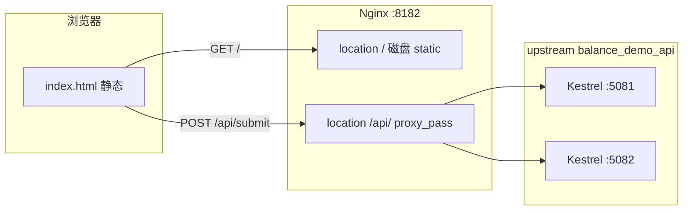

# BalanceNgSvrApiHtml — Nginx 动静分离与负载均衡最小示例

本目录演示：**Nginx 直接出静态 HTML**（静），**仅 `/api/*` 反代到 ASP.NET Core**（动），并通过 **`upstream` 多实例**做简单负载均衡；附带可提交表单与上传文件的 API。

---

## 一、Nginx 如何实现「动静分离」

**含义**：把「可由 Web 服务器直接读磁盘的资源」与「必须由应用服务器计算/读库的请求」分开处理，通常由 Nginx 处理前者，后者反代到 Kestrel / Tomcat 等。

**常见做法**：

| 类型 | 典型路径 | 谁处理 | 说明 |
|------|----------|--------|------|
| 静 | `/`、`/css/`、`/js/`、`/images/`、`*.html` | Nginx `root` / `alias` + `try_files` | 磁盘 IO，不经应用进程，易缓存、易横向扩展静态层 |
| 动 | `/api/`、`/graphql` 等 | `proxy_pass` 到 upstream | 执行业务逻辑、访问数据库、写上传文件等 |

**本示例对应关系**：

- `location /`：`root` 指向本仓库下的 **`static/`**，由 Nginx 返回 `index.html` 等。
- `location /api/`：`proxy_pass` 到 **`upstream balance_demo_api`**，由 ASP.NET Core 处理 JSON/表单上传。

浏览器打开 **`http://入口:8182/`** 加载静态页；页内 `fetch('/api/submit', …)` 仍访问**同源** `/api/...`，由 Nginx 转发到后端，用户无感。

---

## 二、Nginx 如何实现「负载均衡」

**含义**：在多个上游应用实例前增加反向代理，把进入的请求**分发**到不同实例，提高吞吐与可用性。

**核心配置**：`upstream` 块内声明多个 `server ip:port`，在 `location` 里 `proxy_pass http://upstream名字`（**不带路径后缀**，以便保留客户端 URI `/api/xxx` 原样传给上游）。

**常用调度策略**（`upstream` 内指令）：

- **`round_robin`**：默认，依次轮询各 `server`。
- **`least_conn`**：优先分给当前活跃连接少的实例（本示例采用），适合长短不一的请求。
- **`ip_hash`**：按客户端 IP 固定到一台，适合需会话粘滞、未用集中式 Session 时。
- **`weight=`**：加权；**`max_fails` / `fail_timeout`**：失败几次后暂时摘掉实例，实现简单容错。

> 本示例 `deploy/nginx.balance-demo.conf` 中 upstream 配置了 **5081、5082** 两台；若只跑一台 API，请删掉或注释多余 `server` 行，否则会因连不上第二台出现 502。

---

## 三、设计方案（结构）



- **静态**：`static/index.html`（表单 + `multipart/form-data` 上传）。
- **动态**：`BalanceNgSvrApi` 提供 `GET /api/health`、`POST /api/submit`；上传文件写入各实例本地目录 **`BalanceNgSvrApi/uploads/`**（多实例时文件分散在各机，本示例仅作演示；生产应使用共享存储或单写服务）。

---

## 四、目录说明

| 路径 | 说明 |
|------|------|
| `static/index.html` | 演示用静态页（由 Nginx `root` 直接提供） |
| `BalanceNgSvrApi/` | ASP.NET Core 8 最小 Web API |
| `balance-api-python/` | 同契约的 Python（FastAPI）示例，默认端口 **5091** |
| `balance-api-java/` | 同契约的 Java：**默认** Spring Boot **3 + JDK 17**（`pom.xml`）；备选 JDK 8 见 **`README-java8.md`**（`pom-java8.xml`）。端口 **5092** |
| `balance-api-go/` | 同契约的 Go 标准库示例，默认端口 **5093** |
| `balance-api-node/` | 同契约的 Node（Express）+ **`web/`** 下 Vue 3（Vite）前端，API 默认 **5094** |
| `BalanceNgSvrApiHtml.sln` | 解决方案 |
| `deploy/nginx.balance-demo.conf` | 独立迷你 `nginx.conf` 示例（需改 `root` 为你的本机绝对路径） |

以上各 API 均提供 **`GET /api/health`**、**`POST /api/submit`**（与 `BalanceNgSvrApi` 一致）；与 Nginx 联调时把 `upstream balance_demo_api` 里的端口改成你实际启动的实例即可（可同时保留多台做负载均衡）。

---

## 五、使用说明

### 1. 环境要求

- [.NET 8 SDK](https://dotnet.microsoft.com/download/dotnet/8.0)
- [Nginx for Windows](http://nginx.org/en/download.html)（或其它平台 Nginx，配置同理）

若还要跑 **`balance-api-*` 多语言示例**，按需安装（各子目录也有独立说明与 `start.ps1`）：

| 目录 | 依赖 | 一键启动（在对应子目录内） |
|------|------|---------------------------|
| `balance-api-python/` | Python 3.10+ | `.\start.ps1` |
| `balance-api-java/` | **JDK 17+**（默认）或 JDK 8（备选）+ Maven 3.6+ | `.\start.ps1`；JDK 8 用 `.\start-java8.ps1` |
| `balance-api-go/` | Go 1.21+ | `.\start.ps1` |
| `balance-api-node/` | Node.js 18+ | `.\start.ps1`；Vue 开发见 `web\start-dev.ps1` |

### 1b. 多语言 API 环境初始化与自检

与 C# 示例**同一 `/api` 契约**，默认端口 **5091～5094**，可与 `dotnet run` 的 5081/5082 并行。每个子项目 **`README.md`** 中有更细的说明。

**初始化要点**

1. **Python**：安装 Python 并勾选加入 PATH；首次在 `balance-api-python` 执行 `.\start.ps1` 会创建 `.venv` 并 `pip install`（需能访问 PyPI 或已配镜像）。
2. **Java**：默认 **`pom.xml`** 为 **Spring Boot 3 + JDK 17**。`.\start.ps1` / `.\start-java8.ps1` 会**自动发现**常见目录下的 JDK（并临时修正 `PATH`），必要时 **`winget install --source winget …`** 安装 Temurin（跳过 **msstore** 证书问题）；也可先运行 **`balance-api-java\install-jdk.ps1 17`**。若仅有 **JDK 8** 且不用 17，见 **`README-java8.md`** 与 **`.\start-java8.ps1`**。须为 **JDK**（含 `javac`），不能只有 JRE；首次 `mvn` 会拉依赖（需网络或 Maven 镜像）。
3. **Go**：`balance-api-go\start.ps1` 会刷新 PATH、在常见安装目录查找 **`go.exe`**，必要时 **`winget install --source winget GoLang.Go`**（仅用 **winget** 源，避免 **msstore** 证书错误）；也可 **`install-go.ps1`** 后新开终端。`PORT` 为纯数字即可（如 `5093`）。
4. **Node**：`npm install` 一次后即可 `npm start`；Vue 页在 `balance-api-node\web`，需**另开终端**且本机 **5094** 上 API 已启动。

**自检（服务起来后另开终端执行）**

```powershell
curl.exe http://127.0.0.1:5091/api/health   # Python
curl.exe http://127.0.0.1:5092/api/health   # Java
curl.exe http://127.0.0.1:5093/api/health   # Go
curl.exe http://127.0.0.1:5094/api/health   # Node
```

返回 JSON 中含 `"ok":true` 即正常。

> **`balance-api-*` 下的 `*.ps1`**：为兼容 Windows PowerShell 默认代码页，脚本内**提示语使用英文**（避免 UTF-8 中文被误解析导致“字符串缺少终止符”类错误）。  
> 若执行 `.\start.ps1` 被策略拦截，可用：  
> `powershell -ExecutionPolicy Bypass -File .\start.ps1`

### 2. 构建 API

在仓库本目录执行：

```powershell
dotnet build .\BalanceNgSvrApiHtml.sln -c Release
```

**多语言对照实现**（与上文同一 `/api` 契约，端口与 C# 5081/5082 错开，便于本机并行）：

| 目录 | 默认端口 | 启动方式（概要） |
|------|----------|------------------|
| `balance-api-python/` | 5091 | `.\start.ps1` 或 `pip install -r requirements.txt` 后 `python main.py` |
| `balance-api-java/` | 5092 | `.\start.ps1`（JDK 17+）或 `.\start-java8.ps1`（JDK 8）；或 `mvn spring-boot:run` / `java -jar target\...jar` |
| `balance-api-go/` | 5093 | `.\start.ps1` 或 `go run .` |
| `balance-api-node/` | 5094 | `.\start.ps1` 或 `npm install` + `npm start`；Vue：`web\start-dev.ps1` 或 `npm run dev` |

### 3. 启动 API（按 `launchSettings.json` 的 **profiles** 指定端口）

`Properties/launchSettings.json` 里每个 **`"profiles": { "名称": { ... } }`** 对应一个启动配置。用 **`dotnet run --launch-profile <名称>`**（简写 **`-lp`**）选用哪一个，会应用其中的 **`applicationUrl`**、环境变量等。

**在 `BalanceNgSvrApi` 项目目录下：**

```powershell
cd .\BalanceNgSvrApi
dotnet run --launch-profile BalanceNgSvrApi
dotnet run --launch-profile BalanceNgSvrApi_5082
```

**在解决方案根目录 `BalanceNgSvrApiHtml` 下（不 `cd` 进子目录）：**

```powershell
dotnet run --project .\BalanceNgSvrApi\BalanceNgSvrApi.csproj --launch-profile BalanceNgSvrApi
dotnet run --project .\BalanceNgSvrApi\BalanceNgSvrApi.csproj --launch-profile BalanceNgSvrApi_5082
```

| Profile 名称 | 默认地址 |
|--------------|----------|
| `BalanceNgSvrApi` | `http://127.0.0.1:5081` |
| `BalanceNgSvrApi_5082` | `http://127.0.0.1:5082` |

单实例时只起一个 profile 即可；与 Nginx `upstream` 里两台 `server` 对应时，两个终端分别用上面两个 profile 各跑一个进程。

**5081** 自测接口：

```powershell
curl.exe http://127.0.0.1:5081/api/health
```

### 4. 配置并启动 Nginx

1. 编辑 **`deploy/nginx.balance-demo.conf`**：
   - 将 `location /` 下的 **`root`** 改为本机 **`static` 文件夹的绝对路径**（Windows 建议 `C:/.../BalanceNgSvrApiHtml/static` 正斜杠形式）。
   - 若只跑单实例 API，在 `upstream balance_demo_api` 中保留一个 `server` 即可。
2. 用 Nginx 安装目录作为 prefix 启动（避免相对路径错用 CWD 下的 `conf`）：

```cmd
cd /d C:\nginx-1.30.0
nginx.exe -p C:/nginx-1.30.0/ -c C:/你的路径/BalanceNgSvrApiHtml/deploy/nginx.balance-demo.conf
```

若与现有主配置合并：把示例里的 **`upstream`** 与 **`server { ... }`** 片段拷入自己的 `nginx.conf` 的 `http { }` 中，并避免 **`listen` 端口冲突**。

3. 浏览器访问 **`http://127.0.0.1:8182/`**（或 **`http://192.168.201.51:8182/`**），填写表单并选择文件提交；应看到 JSON 响应，文件落在运行中的那个 API 实例的 **`uploads/`** 目录下。

### 5. 停止与排错

- 停止 Nginx：`nginx.exe -p <prefix> -c <conf> -s quit`
- **`CreateFile() ... deploy\mime.types failed`**：独立 conf 里若写 `include mime.types;`，在 Windows 上常相对**当前 conf 所在目录**解析，会去 `deploy/mime.types` 而报错。本仓库示例已改为 **`include C:/nginx-1.30.0/conf/mime.types;`**；合并进主 `nginx.conf` 时**不要**再写 `mime.types`（`http` 块已 include 一次即可）。
- **推荐**：Balance 演示已合并进 **`C:/nginx-1.30.0/conf/nginx.conf`**（`upstream balance_demo_api` + `listen 8182` 的 `server`），与 8538 共用同一 master，执行 **`nginx -p C:/nginx-1.30.0/ -c conf/nginx.conf -s reload`** 即可。
- **502**：upstream 里端口未监听或只启了一个实例却配了两个 `server`。

---

## 六、API 摘要

| 方法 | 路径 | 说明 |
|------|------|------|
| GET | `/api/health` | 健康检查，返回 UTC 时间与机器名 |
| POST | `/api/submit` | `multipart/form-data`：字段 `name`（必填）、`remark`（可选）、`file`（可选文件）；成功返回 JSON，文件保存到 `BalanceNgSvrApi/uploads/` |

---

## 七、与生产环境的差距（备忘）

- 静态与 API 建议 **HTTPS**、**限流**、**WAF**、**真实客户端 IP**（`X-Forwarded-For` 信任链）等未在本最小示例中展开。
- 多实例上传若需「任意节点都能读到同一文件」，需 **共享磁盘 / 对象存储**，或上传走独立文件服务。
- 本示例 API 使用 **`DisableAntiforgery()`** 便于演示；对外暴露的表单 API 应评估 **CSRF** 与认证。

---

## 八、交付脚手架：`main` 更新后重启与自动回滚

在「远程 **`origin/main`** 已有新提交」的机器上，用脚本完成：**快进拉取 →（可选）`dotnet publish` → 按顺序重启 Windows 服务 →（可选）Nginx reload → HTTP 健康检查**；若检查失败，则 **`git reset --hard`** 到部署前提交，再发布/重启并二次检查。

### 8.1 脚本位置

| 文件 | 说明 |
|------|------|
| **`deploy/update-from-main.ps1`** | 主流程（建议由 CI/计划任务在目标机执行） |
| **`deploy/update-config.example.ps1`** | 示例配置；复制为 **`deploy/update-config.ps1`** 后按环境修改（该文件已 **`.gitignore`**，避免把本机路径提交进库） |

### 8.2 流程概要

1. 在 Git 仓库根目录记录 **`HEAD`**（部署前提交）。
2. **`git fetch`** + **`git merge --ff-only origin/main`**：若非快进或有冲突，**立即退出且不重启服务**，由人工处理分支。
3. 若配置了 **`$DeployDotnetPublish`**，执行 **`dotnet publish`**。
4. 按 **`$DeployWindowsServices`** 数组**顺序**执行 **`Restart-Service`**（需管理员权限；无 NSSM 服务可留空数组）。
5. 执行 **`$DeployNginxReloadScript`** 脚本块（如 `nginx -s reload`）；不需要则 `$null`。
6. 轮询 **`$DeployHealthCheckUrls`**，全部 **HTTP 200** 视为成功。
7. 若第 6 步超时仍失败：**`git reset --hard <部署前提交>`** → 若曾 publish 则再 publish 旧代码 → 再重启服务 → 再 reload → 再健康检查；若仍失败，**退出码 3**（需人工）。

### 8.3 退出码

| 退出码 | 含义 |
|--------|------|
| **0** | 部署与健康检查成功 |
| **1** | Git fetch/merge、publish、服务、reset 等异常 |
| **2** | 已回滚且回滚后健康检查通过（业务已回到旧版本） |
| **3** | 回滚后健康检查仍失败 |

### 8.4 常用命令

在 **`BalanceNgSvrApiHtml\deploy`** 目录（或通过 **`-ConfigPath`** 指向配置）：

```powershell
# 仅演练：不执行 fetch/merge/publish/Restart-Service/Nginx/HTTP；仍会只读 `git rev-parse` 打印 HEAD
.\update-from-main.ps1 -DryRun

# 正常：拉 main -> publish -> 重启 -> 健康检查
.\update-from-main.ps1

# 不拉代码，只 publish + 重启 + 检查
.\update-from-main.ps1 -SkipGitPull

# 指定配置文件
.\update-from-main.ps1 -ConfigPath "D:\cfg\balance-update-config.ps1"
```

**注意**：脚本用 `git rev-parse --show-toplevel` 定位仓库根；默认从 **`deploy\..`** 解析，一般为 **AgileConfig 单仓根**。若 Git 根不在该路径，在 **`update-config.ps1`** 中设置 **`$DeployGitRepoRoot`**。

### 8.5 与 CI 的配合

- **Azure DevOps / GitHub Actions**：在 `main` 流水线末尾用 **SSH / self-hosted** 在目标机执行 `update-from-main.ps1`。
- 健康 URL 建议同时包含 **直连 Kestrel**（如 `5081/api/health`）与 **经 Nginx 总入口**（如 **`8182/api/health`**），便于发现反代或静态配置问题。

### 8.6 限制说明

- 回滚依赖 **Git 历史**；部署中若改动了未入库文件需自行备份。
- **多实例**下各机 **uploads** 不一致；回滚不会删除已上传文件。
- **`Restart-Service`** 需**提升权限**；Linux 请改用 systemd 等另行封装。

---

以上内容对应本仓库目录 **`AgileConfig_Client/BalanceNgSvrApiHtml`**（在 AgileConfig 解决方案树中路径为 `src/AgileConfig_Client/BalanceNgSvrApiHtml`）。

## 指定不同 `profiles` 启动

`launchSettings.json` 里 **`"profiles"`** 下的键名就是 profile 名（例如 **`BalanceNgSvrApi`**、**`BalanceNgSvrApi_5082`**）。用：

```powershell
dotnet run --launch-profile <名称>
```

简写：

```powershell
dotnet run -lp <名称>
```

**在项目目录 `BalanceNgSvrApi` 下：**

```powershell
cd BalanceNgSvrApi
dotnet run -lp BalanceNgSvrApi
dotnet run -lp BalanceNgSvrApi_5082
```

**在解决方案目录 `BalanceNgSvrApiHtml` 下：**

```powershell
dotnet run --project .\BalanceNgSvrApi\BalanceNgSvrApi.csproj -lp BalanceNgSvrApi
dotnet run --project .\BalanceNgSvrApi\BalanceNgSvrApi.csproj -lp BalanceNgSvrApi_5082
```

不想用 `launchSettings.json` 时加 **`--no-launch-profile`**，再用 **`--urls`** 指定地址，例如：

```powershell
dotnet run --project .\BalanceNgSvrApi\BalanceNgSvrApi.csproj --no-launch-profile --urls http://127.0.0.1:5081
```

已在 **`BalanceNgSvrApiHtml/README.md`** 的「### 3. 启动 API」里补充上述说明与对照表。